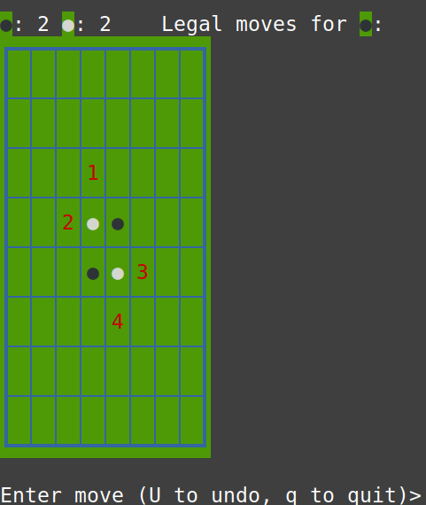
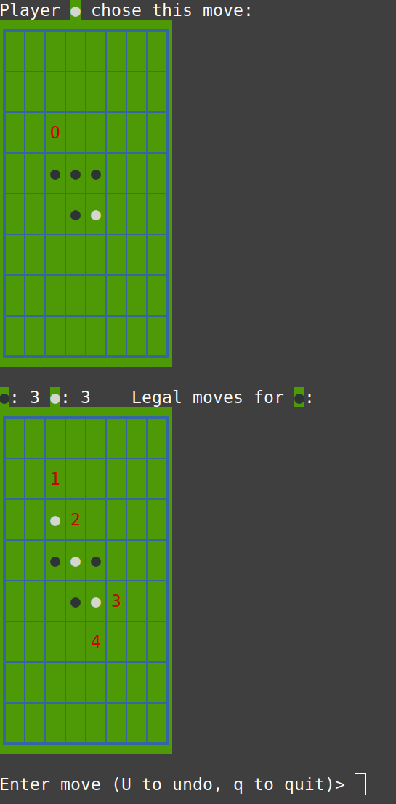

# Bithello -- Bitboard Othello

## Building the code

Try the following instructions in a terminal (tested on Linux and MacOS, with g++-10 and above or clang++-11 and above):

```
git clone https://github.com/eitanf/bithello
make -j test
make -j
```
## Quick start

To run a quick game against an easy  AI, try the following in the terminal:

```
./bithello -d text -l mcts -m 200
```

You will see an initial board game that looks like this:



You play the first (dark) player. You'll see digits or letter for your possible legal moves. For example, let's say you want to make the move denoted by `2`. Simply enter 2 on the prompt and press enter. The computer player (light) will now make its turn, and the board may look something like this (depending on the move the computer chose):



Continue playing till no more legal moves are available, at which point a winner is declared.

You can find instructions on how to play Othello [here](https://www.ultraboardgames.com/othello/game-rules.php) or [here](https://en.wikipedia.org/wiki/Reversi). You may also find this [book](https://web.archive.org/web/20061209182837/http://othellogateway.strategicviewpoints.com/rose/book.pdf) interesting if you want to dive deeper into the strategy of the game.

## Command-line options

You can set the different players to be either human (text); random, which picks a random move each turn and is very easy to beat (random), or Monte-Carlo tree-search AI (mcts). You can further configure the strength of the AI player. Try `./bithello -h` for a full list of current options.

You can play human against human on the same terminal (both players as `text`), human against computer, or computer against computer. The MCTS player can be configured to evaluate a fixed number of moves per turn, or a fixed amount of time in milliseconds.

## Performance

If you're curious about the performance of the MCTS algorithm, or you want to improve it, you can turn on the performance counters that measure how many total game plays and moves each MCTS player evaluated. To enable these counters, add `-DBENCHMARK` to the compilation flags (`CXXFLAGS`) in the Makefile, then run `make clean && make` and run a game of computer against computer.

By default, bithello will use as many threads as the hardware supports. You can control the actual number of threads with the NTHREAD environment variable. For example, to run a single-threaded MCTS player (50ms per move) against the random player, you can try:

```
NTHREAD=1 ./bithello -d mcts -t 50 -l random
```

For example, running MCTS against itself (200ms per turn, averaged over 10 games) yields about 135M move evaluations per second on AMD 5950x and g++-11 (16 threads) 


## TODO

Here are some ideas how to make the MCTS player much stronger:

  * Create a tree of MCTSNodes for N moves forward (instead of just one move), and evaluate only the last level of the tree. This will save a lot of CPU effort of recomputing the available moves and board for those N-1 levels.
  * Caching previous wins/loss data for these nodes (since the multilevel tree will necessarily compute data for sthe next N-1 boards to be used).
  * Spread the timing per move across the entire game so that very little time is expended in the first turn and the last few, and more on the mid-game critical moves.


### License

Distributed under the [GPL v.3](https://www.gnu.org/licenses/gpl-3.0.en.html) license.
